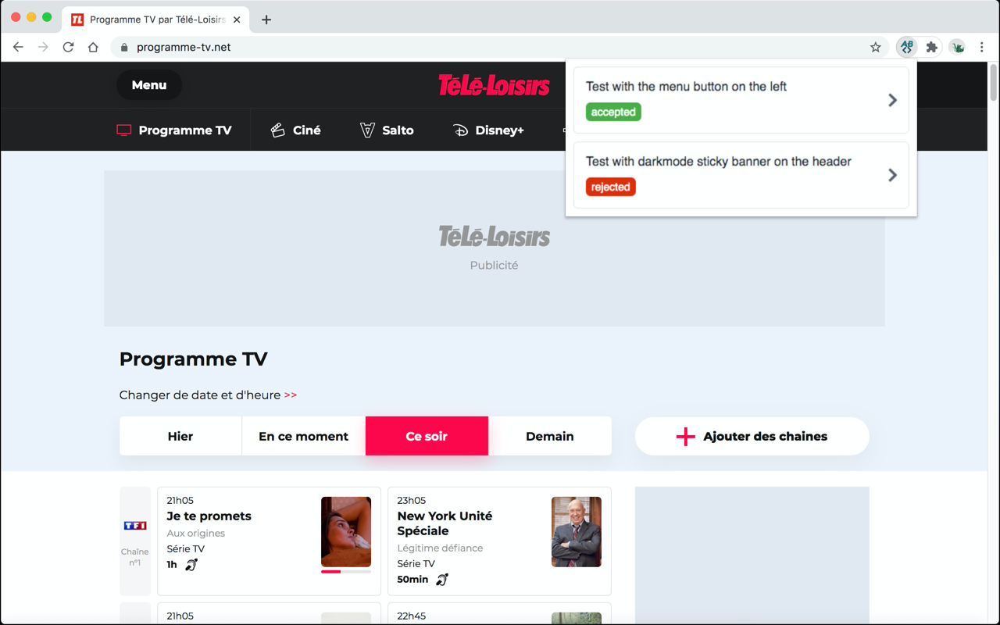
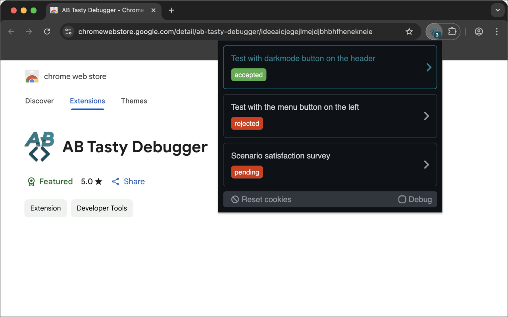
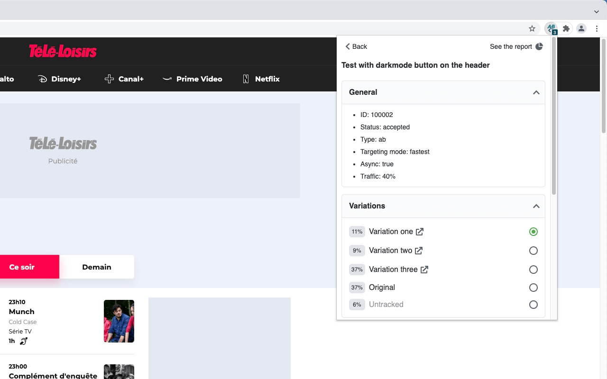
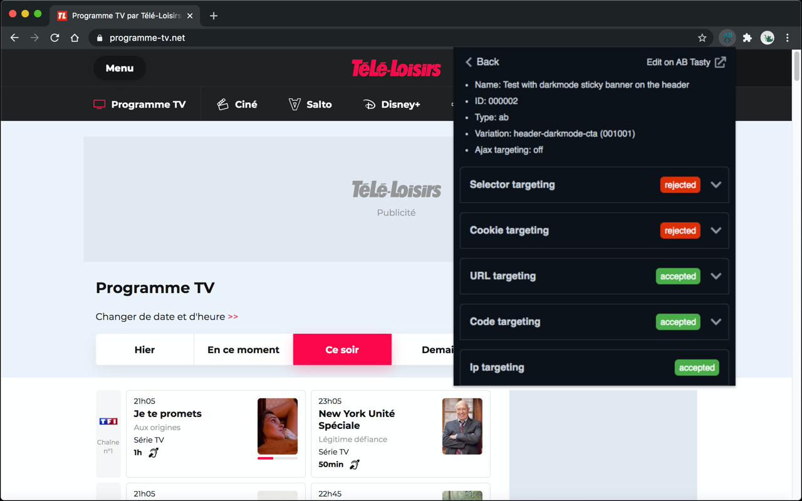

# AB Tasty Debugger

  

`AB Tasty Debugger` is a browser extension that simplifies the debugging of A/B Tests from AB Tasty and adds useful informations.

Display A/B tests available on the current page and debug targeting informations. For example, if a test is not displaying, the extension display which targetings are not valid.

## Installation

The `AB Tasty Debugger` browser extension is available for:

|  |  |  |
| :---------------------------------------------------------------------------------------------------------------------------------------------------------------------------------------------------------------------------------: | :-----------------------------------------------------------------------------------------------------------------------------------------------------------------------------------------------: | :-------------------------------------------------------------------------------------------------------------------------------------------------------------------------------------------------------------------------: |
|                                                               [Chrome](https://chrome.google.com/webstore/detail/ab-tasty-debugger/ideeaicjegejlmejdjbhbhfhenekneie)                                                                |                                                                   [Firefox](https://addons.mozilla.org/addon/abtasty-debugger)                                                                    |                                                                 [Edge](https://microsoftedge.microsoft.com/addons/detail/agniifpndnebgiaeajkkebdmceajjajl)                                                                  |

---

## Features

- Dark mode compatible (user preference media feature).
- Displays a badge with the number of A / B tests found on the current page.
- Displays a list of all A/B tests available on the current page with their status.
- The list of A/B tests is sorted to show the accepted tests at the top of the list.
- Displays a clear AB Tasty cookies button to clear AB Tasty cookies and reload the page.
- Displays a debug mode button to activate AB Tasty logs in the DevTools console.
- Displays a detail view of each tests with their general informations (ID, status, type, targeting mode, async, traffic).
- Displays a link to see the test report.
- List all variations of the test if the status is `accepted` or `traffic_rejected`, with their name, traffic, a link of JSON modifications and activation button.
- List all trackings information of the test with their name and selector.
- List all targeting information of the test (segment, trigger, URL, code, selector, cookie, IP) with their status.
- Displays a link to edit the test targetings on the AB Tasty editor.
- The list of targeting is sorted to show the invalid targets at the top of the list.
- Collapse/expand all variations, trackings and targetings information.

<table>
    <tr>
        <td width="50%">
            
<strong>List A/B tests</strong>

            

        </td>
        <td width="50%">
            
<strong>List A/B tests in dark mode</strong>

            

        </td>
    </tr>
    <tr>
        <td width="50%">
            
<strong>Detail of an A/B test</strong>

            

        </td>
        <td width="50%">
            
<strong>Detail of an A/B test in dark mode</strong>

            

        </td>
    </tr>
</table>

---

## Licence

`AB Tasty Debugger` and its documentation are licensed under the [MIT License](http://opensource.org/licenses/MIT).

Created with ♥ by [@yoriiis](http://github.com/yoriiis).
