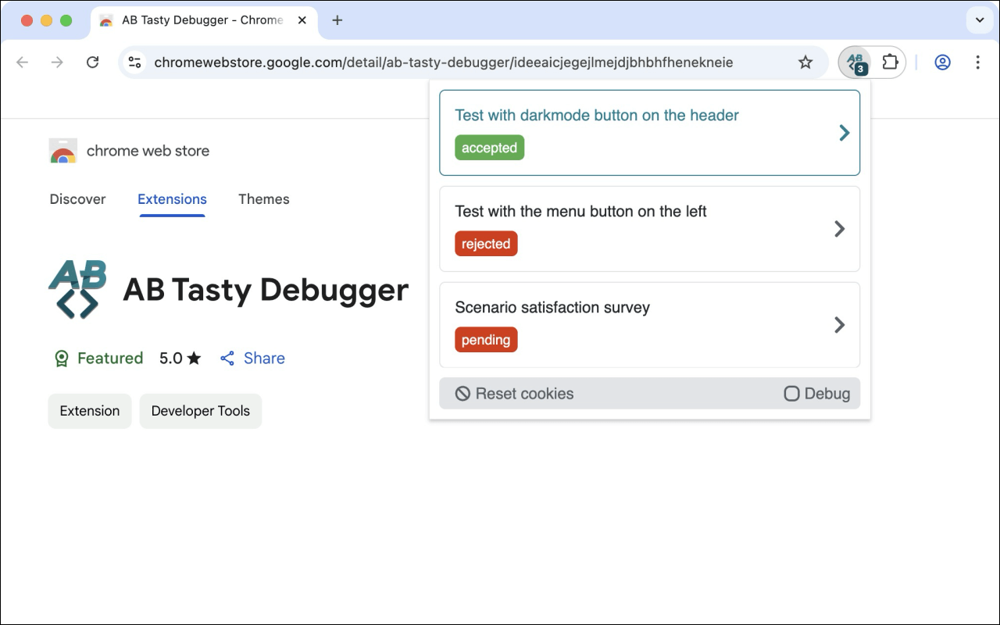
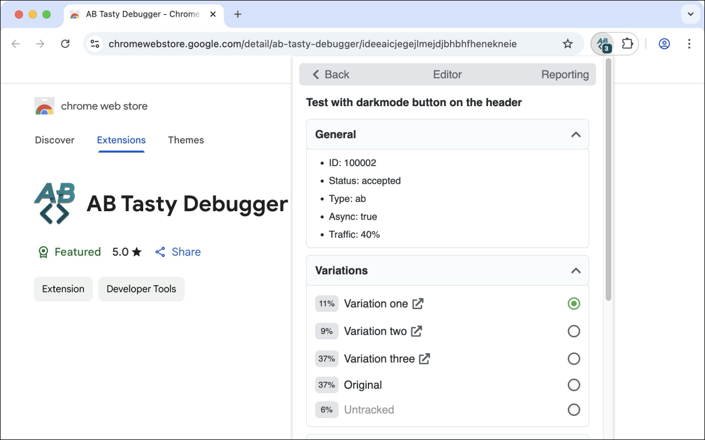
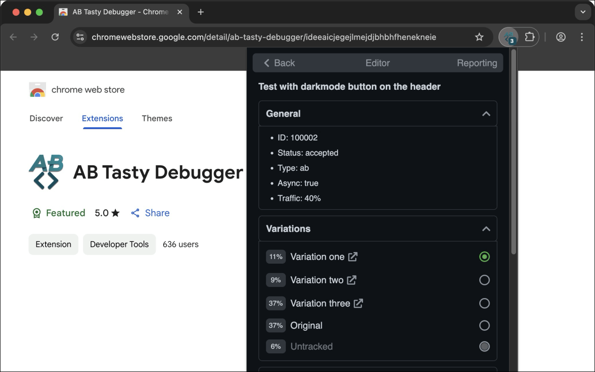

# AB Tasty debugger

  

`ABTastyDebugger` is a browser extension that simplifies the debugging of A/B Tests from AB Tasty and adds useful informations.

Display A/B tests available on the current page and debug targeting informations. For example, if a test is not displaying, the extension display which targetings are not valid.

## Installation

The `AB Tasty Debugger` browser extension is available for:

|  |  |  |  |
| :--------------------------------------------------------------------------------------------------------------------------------------------------: | :---------------------------------------------------------------------------------------------------------------------------------------------------: | :-----------------------------------------------------------------------------------------------------------------------------------: | :------------------------------------------------------------------------------------------------------------------------------------------------------------: |
|                                                     [Chrome](https://chrome.google.com/webstore)                                                     |                                                         [Firefox](https://addons.mozilla.org)                                                         |                                                   [Opera](https://addons.opera.com)                                                   |                                                       [Edge](https://microsoftedge.microsoft.com/addons)                                                       |

---

## Features

- Dark mode compatible (user preference media feature).
- Displays a badge with the number of A / B tests found on the current page.
- Displays a list of all A/B tests available on the current page with their status.
- The list of A/B tests is sorted to show the accepted tests at the top of the list.
- Displays a detail view of each tests with their general informations (ID, name, ajax targeting).
- Displays a link to edit the test on the AB Tasty editor.
- List all targeting informations of the test (URL, code, selector, cookie, IP) with their status.
- The list of targeting is sorted to show the invalid targets at the top of the list.
- Collapse/expand all targeting informations.
- No permissions requested and no data collected.

<table>
    <tr>
        <td width="50%">
            
<strong>List A/B tests</strong>

            

        </td>
        <td width="50%">
            
<strong>List A/B tests in dark mode</strong>

            

        </td>
    </tr>
    <tr>
        <td width="50%">
            
<strong>Detail of an A/B test</strong>

            

        </td>
        <td width="50%">
            
<strong>Detail of an A/B test in dark mode</strong>

            

        </td>
    </tr>
    <tr>
        <td width="50%">
            
<strong>Detail opened of an A/B test</strong>

            

        </td>
        <td width="50%">
            
<strong>Detail opened of an A/B test in dark mode</strong>

            

        </td>
    </tr>
</table>

---

## Licence

`ABTastyDebugger` and its documentation are licensed under the [MIT License](http://opensource.org/licenses/MIT).

Created with ♥ by [@yoriiis](http://github.com/yoriiis).
